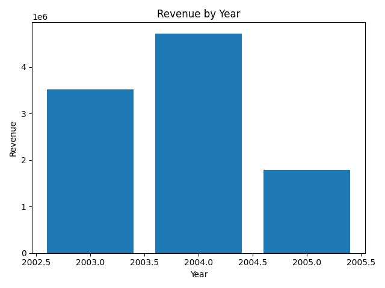

## Key Insights

- Analyzed 2,823 sales records using Python (pandas)
- Total revenue across all orders was **$10.03M**
- Revenue peaked in **2004 ($4.72M)** after growing from **$3.52M in 2003**
- Sales declined in **2005 ($1.79M)**, likely due to partial-year data
- Python (pandas) analysis reproduced SQL results exactly, validating data accuracy across tools
- ### Revenue Trend Visualization

## How to Run This Project
- Open `analysis.ipynb` in Jupyter Notebook or JupyterLab
- Run all cells to reproduce the analysis and chart
- Dataset is included / loaded within the notebook

